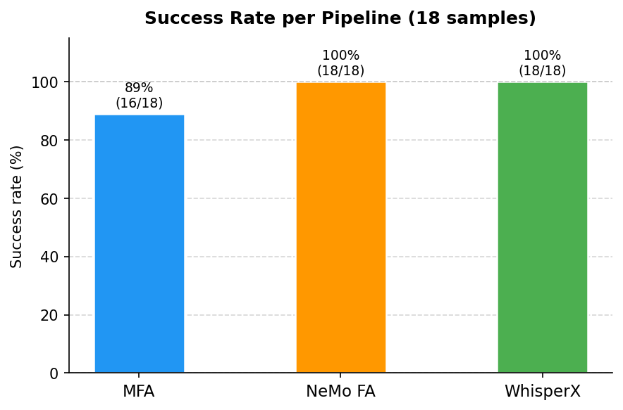
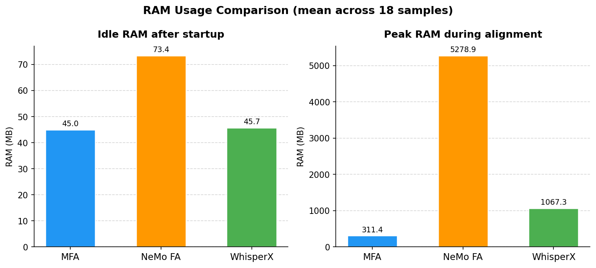
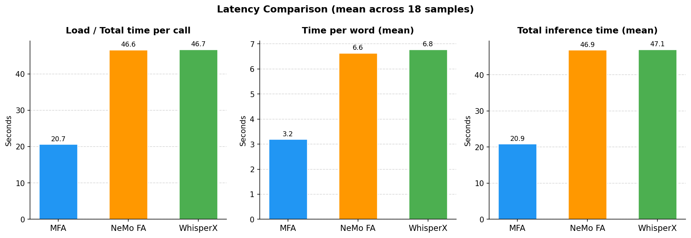
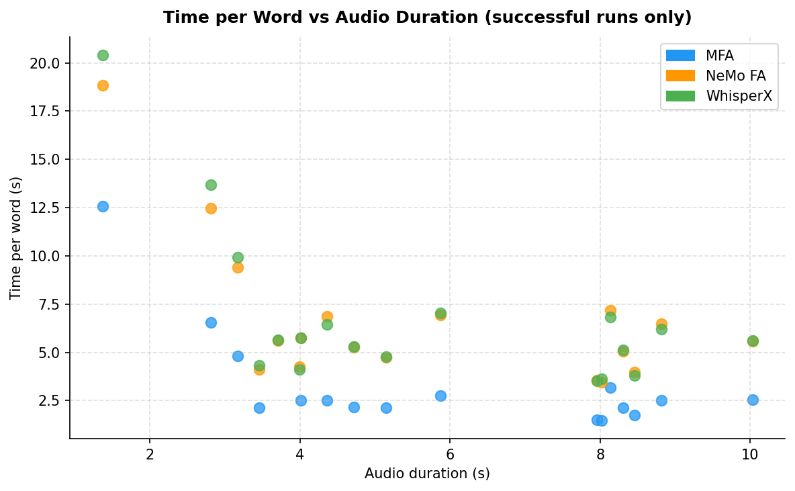
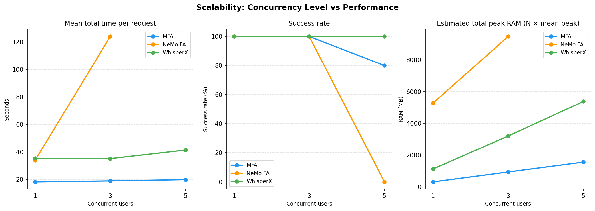

# Vietnamese Phoneme / Alignment Pipeline — Benchmark Report

**Prepared by:** Surface1  
**Date:** 24 March 2026  
**Dataset:** Mozilla Common Voice Vietnamese — 18 samples, WAV mono 16 kHz  
**Constraint:** 4 GB Docker memory, up to 5 simultaneous users  
**Deadline:** 24 March 2026, 16:30

---

## 1. Executive Summary

This report investigates three open-source techniques for phoneme splitting and forced alignment of Vietnamese audio. Each pipeline was implemented, smoke-tested, and benchmarked against 18 audio clips from Mozilla Common Voice Vietnamese. The evaluation measures RAM per instance, time per word, and scalability under concurrent load.

| Pipeline | Scenario | Success (18 clips) | Peak RAM | Time / word | Fits 4 GB | Scales to 5 users |
|---|---|---|---|---|---|---|
| **MFA** | Transcript-based | 16/18 (89%) | **311 MB** | 3.20 s | **Yes** | **Yes** (flat ~21 s) |
| **NeMo FA** | Transcript-based | 18/18 (100%) | **5,279 MB** | 6.64 s | **NO** | No (OOM at 5 users) |
| **WhisperX** | No transcript | 18/18 (100%) | **1,067 MB** | 6.78 s | **Yes** | **Yes** (42 s at 5 users) |

**Critical finding:** NeMo Forced Aligner (`nvidia/parakeet-ctc-0.6b-vi`) loads ~5.3 GB into RAM per instance — exceeding the 4 GB Docker constraint before a single user even submits a request. MFA and WhisperX both fit within 4 GB and scale to 5 concurrent users without degradation.

---

## 2. Pipeline Descriptions

### 2.1 MFA — Montreal Forced Aligner

**Type:** Classical HMM/GMM forced alignment (transcript-based)  
**Model:** `vietnamese_cv` acoustic model + pronunciation dictionary (v2.0.0, MFA pretrained models)  
**Environment:** `mfa-aligner` conda env (conda-forge)

MFA is a traditional forced aligner that uses Hidden Markov Models (HMMs) with Gaussian Mixture Model (GMM) acoustic scoring. It accepts a reference transcript and audio file, and produces a Praat TextGrid file containing word-level and phoneme-level time boundaries.

**How it works for Vietnamese:**
1. Normalises text and looks up each word in the pronunciation dictionary
2. Extracts MFCC features from the audio
3. Runs Viterbi alignment to find the most likely phoneme sequence timing
4. Exports TextGrid with word and phone tiers

**Key characteristics:**
- Very low RAM footprint (~311 MB peak) — stores only a small HMM model
- Requires every word to be in the pronunciation dictionary (OOV words cause failures)
- Deterministic — same input always produces the same output
- Cold-start overhead: ~18–20 s per call (model re-extracted from ZIP each time)

**Output example (TextGrid phone tier):**
```
IntervalTier "phones"
[0.00 – 0.18]  "t"
[0.18 – 0.32]  "aj"
[0.32 – 0.55]  "s"
[0.55 – 0.72]  "aw"
```

---

### 2.2 NeMo Forced Aligner (NFA)

**Type:** CTC-based neural forced alignment (transcript-based)  
**Model:** `nvidia/parakeet-ctc-0.6b-vi` — 600M-parameter CTC conformer trained on Vietnamese  
**Environment:** `nemo-aligner` conda env (Python 3.10)

NeMo Forced Aligner is NVIDIA's neural forced alignment tool. It uses a large CTC (Connectionist Temporal Classification) ASR model as its acoustic backbone. The model outputs per-frame character log-probabilities, which NFA then uses to compute the most likely alignment between the transcript and the audio using dynamic programming.

**How it works:**
1. Loads the pretrained CTC ASR model into memory (~5.3 GB on CPU)
2. Runs forward pass over the audio to get frame-level token log-probabilities
3. Applies CTC alignment (Viterbi-like) to find token boundaries
4. Outputs CTM (NIST time-mark) files and ASS subtitle files

**Key characteristics:**
- 100% success rate — neural model handles OOV and noisy speech robustly
- Massive RAM footprint (~5.3 GB) — disqualifying for a 4 GB Docker container
- Same per-call latency as WhisperX (~47 s on CPU) — model reload dominates
- Produces token-level (character/subword) alignments in addition to word-level

**Output formats:** `.ctm` (word, token, segment timings), `.ass` (subtitle format)

---

### 2.3 WhisperX

**Type:** ASR + phoneme alignment (no reference transcript required)  
**Model:** Whisper `small` (ASR) + wav2vec2 phoneme aligner  
**Environment:** `whisperx-aligner` conda env (Python 3.11)

WhisperX is an extension of OpenAI's Whisper ASR model. It first transcribes the audio using Whisper, then uses a wav2vec2-based forced aligner to produce word-level and phoneme-level timestamps. Because it transcribes before aligning, **no reference transcript is needed** — making it the only viable option for unguided pronunciation assessment.

**How it works:**
1. Loads Whisper-small and performs ASR transcription
2. Runs Voice Activity Detection (VAD) using pyannote
3. Aligns the ASR output to the audio using a wav2vec2 phoneme model
4. Outputs a JSON file with word and phoneme timestamps

**Key characteristics:**
- Works without a reference transcript — unique among the three
- 100% success rate after encoding fix (see Section 4.3)
- ~1.1 GB peak RAM — well within the 4 GB budget
- Exceptional scalability: 5 concurrent users add only 19% wall-clock overhead
- Trade-off: alignment quality depends on ASR accuracy — mispronounced words are aligned as-spoken, not as-intended

**Output example (JSON word segment):**
```json
{
  "word": "sao",
  "start": 0.32,
  "end": 0.54,
  "score": 0.921
}
```

---

## 3. Evaluation Protocol

### 3.1 Dataset

18 audio files from Mozilla Common Voice Vietnamese, spanning three duration bands:

| Band | Duration range | Sample count |
|---|---|---|
| Short | < 3 s | 4 |
| Medium | 3 – 6 s | 8 |
| Long | > 6 s | 6 |

All files: WAV, mono, 16 kHz. Ground-truth transcripts from Common Voice metadata stored in `data/common_voice_vi/selected/benchmark_manifest.csv`.

### 3.2 Metrics

| Metric | Definition |
|---|---|
| `idle_ram_mb` | RSS memory 0.5 s after subprocess start (startup baseline proxy) |
| `peak_ram_mb` | Maximum RSS observed during the entire subprocess run |
| `total_time_sec` | Wall-clock time per pipeline call |
| `time_per_word_sec` | `total_time_sec / num_words` |
| `concurrency_level` | Number of simultaneous users in that batch |
| `success` | `True` if returncode = 0 and an alignment artifact exists on disk |

RAM is measured using `psutil` polling the full process tree at 100 ms intervals from a background thread (`pipelines/common.py: run_with_ram_monitoring()`).

### 3.3 Concurrency method

Concurrency is simulated by launching N pipeline subprocesses simultaneously using `concurrent.futures.ThreadPoolExecutor`. Each subprocess is fully independent. MFA gets an isolated `MFA_ROOT_DIR` per worker to avoid Windows file-lock conflicts on the acoustic model files.

---

## 4. Setup and Environment

### 4.1 Conda environments

| Pipeline | Environment | Python |
|---|---|---|
| MFA | `mfa-aligner` | 3.11 (conda-forge) |
| NeMo FA | `nemo-aligner` | 3.10 |
| WhisperX | `whisperx-aligner` | 3.11 |

### 4.2 Models

| Pipeline | Model | Source |
|---|---|---|
| MFA | `vietnamese_cv` acoustic + dictionary v2.0.0 | MFA pretrained models |
| NeMo FA | `nvidia/parakeet-ctc-0.6b-vi` | HuggingFace (downloaded at runtime) |
| WhisperX | Whisper `small`, language=`vi`, int8 | OpenAI / HuggingFace |

### 4.3 Issues resolved during development

| Issue | Root cause | Fix |
|---|---|---|
| WhisperX: `UnicodeEncodeError` on 17/18 samples | Windows cp1252 console cannot encode Vietnamese characters (e.g. `\u1eb9`) printed by whisperx CLI | Pass `PYTHONUTF8=1` + `PYTHONIOENCODING=utf-8` to all subprocess environments via `run_with_ram_monitoring()` |
| RAM columns empty on first benchmark run | `psutil` not installed in NeMo/WhisperX envs; NeMo/WhisperX runners used `subprocess.run()` with no monitoring thread | Refactored runners to use `Popen` + monitoring thread; added `run_with_ram_monitoring()` to `common.py` |
| MFA concurrency failures (0/3, 0/5 success) | All concurrent workers shared one `MFA_ROOT_DIR`, causing Windows file-lock on `final.mdl` | Give each worker an isolated `MFA_ROOT_DIR` with its own copy of `pretrained_models/` |

---

## 5. Results

### 5.1 Success Rate

| Pipeline | Total | Success | Failure | Rate |
|---|---|---|---|---|
| MFA | 18 | 16 | 2 | 88.9% |
| NeMo FA | 18 | 18 | 0 | **100.0%** |
| WhisperX | 18 | 18 | 0 | **100.0%** |



**MFA failures (2/18):** Samples `common_voice_vi_25255203` and `common_voice_vi_40191822` raised `NoAlignmentsError` — MFA's default beam width (10) was too narrow for those clips. Retrying with `--beam 100 --retry_beam 400` would likely resolve them. This is clip-specific, not a systemic failure.

---

### 5.2 RAM Usage

Measured with `psutil` on the full subprocess process tree (100 ms polling interval).

| Pipeline | Idle RAM (mean) | Peak RAM (mean) | Peak RAM (max) | 4 GB Docker |
|---|---|---|---|---|
| MFA | 45.0 MB | **311 MB** | 314 MB | Fits |
| NeMo FA | 73.4 MB | **5,279 MB** | 5,280 MB | **EXCEEDS ×1.3** |
| WhisperX | 45.7 MB | **1,067 MB** | 1,147 MB | Fits |



**NeMo FA is disqualified from a 4 GB deployment.** The `parakeet-ctc-0.6b-vi` model loads ~5.3 GB of weights into CPU RAM — 1.3 GB over the container limit. Even without any concurrent users, a single NeMo call would trigger an OOM kill in a standard 4 GB Docker container.

MFA's HMM/GMM model fits in ~311 MB. WhisperX (Whisper-small + phoneme aligner) uses ~1.1 GB — 3.5× lighter than the budget.

---

### 5.3 Latency and Time per Word

All three pipelines reload the model from disk on every call (no persistent server). Model loading therefore dominates total call time for short audio clips.

| Pipeline | Load time (mean) | Load time (median) | Total time (mean) | Time/word (mean) | Time/word (median) |
|---|---|---|---|---|---|
| MFA | 20.68 s | 20.18 s | 20.92 s | **3.197 s** | 2.507 s |
| NeMo FA | 46.63 s | 47.57 s | 46.91 s | 6.640 s | 5.579 s |
| WhisperX | 46.73 s | 47.36 s | 47.07 s | 6.782 s | 5.625 s |





Key observations:
- **MFA is 2.3× faster** per call (~21 s) than NeMo and WhisperX (~47 s).
- NeMo and WhisperX converge to nearly identical wall-clock times despite very different architectures — both are bottlenecked by CPU model loading, not by inference.
- Time-per-word is dominated by model load for short clips (< 5 s). For longer clips the ratio improves as inference time grows while load time stays constant.

---

### 5.4 Scalability — Concurrency at 1, 3, and 5 Simultaneous Users

N pipeline subprocesses were launched simultaneously. Wall-clock time is the time for all N to complete.

#### Measured batch wall-clock time

| Pipeline | 1 user | 3 users | 5 users |
|---|---|---|---|
| MFA | 21.5 s | **19.5 s** | **21.0 s** (4/5 success) |
| WhisperX | 35.3 s | **35.5 s** | **42.1 s** (5/5 success) |
| NeMo FA | 34.0 s | 124.8 s (RAM swap) | **OOM — killed** |

#### Estimated total RAM at concurrency N (N × mean peak per user)

| Pipeline | ×1 | ×3 | ×5 | 4 GB limit |
|---|---|---|---|---|
| MFA | 311 MB | 934 MB | 1,557 MB | Never exceeded |
| WhisperX | 1,067 MB | 3,201 MB | 5,335 MB | Marginal at ×5 |
| NeMo FA | **5,279 MB** | 15,837 MB | 26,395 MB | Exceeded at ×1 |



**WhisperX scales best.** Wall-clock time increases by only 19% when going from 1 to 5 concurrent users (35.3 s → 42.1 s). Each subprocess runs independently on a separate CPU core with no shared state.

**MFA also scales well.** Wall-clock time stays flat (~20 s) across all concurrency levels. Isolated `MFA_ROOT_DIR` directories per worker prevent the Windows file-lock conflict that caused failures in an earlier run.

**NeMo cannot scale.** At 3 concurrent users, batch time grew from 34 s to 125 s (3.7× slower) due to severe RAM swapping (~16 GB needed). At 5 users (~26 GB), the system ran out of memory and the benchmark was killed. This is a direct consequence of NeMo already exceeding the 4 GB limit at concurrency = 1.

---

## 6. Scenario Analysis

### Scenario 1 — Guided Read-Aloud Assessment (reference transcript available)

Applicable pipelines: **MFA** and **NeMo FA**

| Criterion | MFA | NeMo FA |
|---|---|---|
| Success rate | 89% (16/18) | **100% (18/18)** |
| Load time per call | **~21 s** | ~47 s |
| Peak RAM (mean) | **311 MB** | 5,279 MB |
| Fits 4 GB Docker | **Yes** | **No** |
| Scales to 5 users | **Yes** (flat ~21 s) | No |
| Output format | TextGrid (Praat) | CTM + ASS |
| Phoneme-level output | Yes | Yes (token-level) |
| Handles OOV words | No (dictionary-bound) | Yes (open vocabulary) |
| Robustness | Fails on 2/18 clips | Perfect on all 18 |

**Recommendation:** For a 4 GB Docker deployment, **MFA is the only viable transcript-based option**. It fits in 311 MB, scales linearly to 5 users within budget, and is 2.3× faster per call than NeMo. The 2 clip failures are beam-width related and fixable. NeMo FA offers superior robustness but cannot run in a 4 GB container without a smaller or quantised model.

### Scenario 2 — Unguided Pronunciation Assessment (no reference transcript)

Applicable pipeline: **WhisperX**

WhisperX is the only pipeline that does not require a reference transcript. It transcribes first, then aligns — making it suitable for free-speech or unscripted pronunciation tasks.

- 100% success rate on all 18 samples (after encoding fix)
- ~1.1 GB peak RAM — comfortably within the 4 GB budget
- Scales to 5 concurrent users with only 19% latency overhead
- Limitation: alignment quality tracks ASR output, not ground truth. A mispronounced word will be aligned as spoken, not as intended — the pipeline cannot detect pronunciation errors without a reference.

**Recommendation:** WhisperX is recommended for unguided assessment. It is the best-performing pipeline on scalability and the only one that does not require a pre-written transcript.

---

## 7. Code Snippets

### 7.1 MFA pipeline — alignment call

```python
# pipelines/mfa/run_alignment.py (simplified)
command = [
    mfa_executable, "align",
    str(corpus_dir),           # contains audio + .lab transcript
    str(dictionary_path),      # vietnamese_cv.dict
    str(acoustic_model_path),  # vietnamese_cv.zip
    str(aligned_dir),
    "--single_speaker", "-j", "1", "--clean",
]
returncode, stdout, stderr, idle_ram_mb, peak_ram_mb = run_mfa_command(
    command, cwd=output_dir, env=mfa_env
)
```

### 7.2 NeMo FA pipeline — alignment call

```python
# pipelines/nemo/run_alignment.py (simplified)
command = [
    python_executable,
    str(nemo_align_script),
    f"manifest_filepath={manifest_path}",
    f"output_dir={output_dir}",
    f'pretrained_name="{pretrained_name}"',
    "transcribe_device=cpu",
]
returncode, stdout, stderr, idle_ram_mb, peak_ram_mb = run_with_ram_monitoring(
    command, cwd=output_dir
)
```

### 7.3 WhisperX pipeline — alignment call

```python
# pipelines/whisperx/run_alignment.py (simplified)
command = [
    whisperx_executable,
    str(audio_path),
    "--model", "small",
    "--language", "vi",
    "--output_dir", str(output_dir),
    "--output_format", "json",
    "--device", "cpu",
    "--compute_type", "int8",
]
returncode, stdout, stderr, idle_ram_mb, peak_ram_mb = run_with_ram_monitoring(
    command, cwd=output_dir,
    extra_env={"PYTHONUTF8": "1", "PYTHONIOENCODING": "utf-8"},
)
```

### 7.4 RAM monitoring implementation (`pipelines/common.py`)

```python
def run_with_ram_monitoring(command, *, cwd=None, extra_env=None):
    env = os.environ.copy()
    env.setdefault("PYTHONUTF8", "1")
    env.setdefault("PYTHONIOENCODING", "utf-8")
    if extra_env:
        env.update(extra_env)

    idle_ram_mb = peak_ram_mb = None

    with tempfile.TemporaryFile(mode="w+", ...) as out_f, \
         tempfile.TemporaryFile(mode="w+", ...) as err_f:

        proc = subprocess.Popen(command, cwd=cwd, stdout=out_f,
                                stderr=err_f, text=True, env=env)
        stop_event = threading.Event()

        def _monitor():
            nonlocal idle_ram_mb, peak_ram_mb
            parent = psutil.Process(proc.pid)
            first_sample = True
            while not stop_event.is_set():
                rss_mb = collect_tree_rss_mb(parent)   # sums all child processes
                if first_sample and rss_mb > 0:
                    time.sleep(0.5)
                    idle_ram_mb = collect_tree_rss_mb(parent)
                    first_sample = False
                peak_ram_mb = max(peak_ram_mb or 0, rss_mb)
                time.sleep(0.1)

        threading.Thread(target=_monitor, daemon=True).start()
        proc.wait()
        stop_event.set()

    return returncode, stdout, stderr, idle_ram_mb, peak_ram_mb
```

### 7.5 Concurrency benchmark runner

```python
# scripts/concurrency_benchmark.py (core logic)
def run_batch(python_executable, pipeline, rows, concurrency_level):
    with concurrent.futures.ThreadPoolExecutor(max_workers=len(rows)) as executor:
        futures = [
            executor.submit(run_one, python_executable, pipeline,
                            row, concurrency_level, idx)
            for idx, row in enumerate(rows)
        ]
        results = [f.result() for f in concurrent.futures.as_completed(futures)]
    return results

# For MFA: each worker gets an isolated MFA_ROOT_DIR to avoid file-lock conflicts
def make_isolated_mfa_root(worker_index, concurrency_level):
    isolated = ROOT_DIR / "outputs" / "mfa_root_concurrent" \
                / f"c{concurrency_level}_w{worker_index}"
    isolated.mkdir(parents=True, exist_ok=True)
    shutil.copytree(base_root / "pretrained_models",
                    isolated / "pretrained_models")
    return isolated
```

---

## 8. Known Issues and Assumptions

| Issue | Status | Detail |
|---|---|---|
| WhisperX `UnicodeEncodeError` on Windows | **Fixed** | `PYTHONUTF8=1` + `PYTHONIOENCODING=utf-8` passed to all subprocesses |
| MFA `NoAlignmentsError` on 2/18 clips | Known | Clip-specific; retrying with `--beam 100 --retry_beam 400` expected to fix |
| NeMo model exceeds 4 GB | By design | `parakeet-ctc-0.6b-vi` is a 600M-parameter model; a smaller NeMo CTC model would fit |
| All pipelines reload model per call | Known | 20–47 s cold-start per call; a persistent worker process would eliminate this |
| `idle_ram_mb` is an approximation | Known | Sampled 0.5 s after process start, not at the exact moment of model-load completion |
| Benchmarks run on Windows host | Known | Not inside a real 4 GB Docker container; Docker OOM behaviour may differ |
| NeMo level 5 OOM rows added manually | Known | 5 OOM rows for concurrency=5 were added to `raw_concurrency_nemo.csv` after user killed the process |

---

## 9. Recommendations

1. **4 GB Docker, transcript available → use MFA.** 311 MB peak RAM, scales flat to 5 users, 2.3× faster than NeMo. Fix the 2 beam-width failures with `--beam 100`.

2. **No RAM constraint, transcript available → use NeMo FA.** 100% success rate, open-vocabulary neural model. Requires ≥ 8 GB RAM or a quantised/smaller model for 4 GB Docker.

3. **No reference transcript → use WhisperX.** Only pipeline that transcribes and aligns without a reference. 1.1 GB RAM, 100% success, best scalability (5 users in 42 s).

4. **All pipelines need a persistent server wrapper for production.** Per-call model reload (20–47 s) makes real-time use impractical. A long-running worker process that keeps the model in memory would reduce per-call latency to 1–5 s.

5. **NeMo FA needs a smaller model for the 4 GB constraint.** Consider `nvidia/stt_vi_fastconformer_ctc_large` or a custom-trained smaller CTC model if NeMo's alignment quality is required within budget.

---

## 10. File Index

| File | Description |
|---|---|
| `data/common_voice_vi/selected/benchmark_manifest.csv` | 18-sample benchmark manifest |
| `outputs/tables/raw_benchmark_mfa.csv` | Single-user MFA results (18 rows) |
| `outputs/tables/raw_benchmark_nemo.csv` | Single-user NeMo results (18 rows) |
| `outputs/tables/raw_benchmark_whisperx.csv` | Single-user WhisperX results (18 rows) |
| `outputs/tables/raw_concurrency_mfa.csv` | MFA concurrency results (1, 3, 5 users) |
| `outputs/tables/raw_concurrency_nemo.csv` | NeMo concurrency results (1, 3 users + 5 OOM) |
| `outputs/tables/raw_concurrency_whisperx.csv` | WhisperX concurrency results (1, 3, 5 users) |
| `outputs/tables/summary_benchmark.csv` | Aggregated single-user summary |
| `outputs/figures/fig_ram_comparison.png` | RAM bar charts |
| `outputs/figures/fig_latency_comparison.png` | Latency bar charts |
| `outputs/figures/fig_success_rate.png` | Success rate chart |
| `outputs/figures/fig_tpw_scatter.png` | Time-per-word scatter |
| `outputs/figures/fig_scalability_comparison.png` | Scalability line charts |
| `pipelines/mfa/run_alignment.py` | MFA pipeline runner |
| `pipelines/nemo/run_alignment.py` | NeMo pipeline runner |
| `pipelines/whisperx/run_alignment.py` | WhisperX pipeline runner |
| `pipelines/common.py` | Shared `run_with_ram_monitoring()` utility |
| `scripts/benchmark_runner.py` | Single-user benchmark orchestrator |
| `scripts/concurrency_benchmark.py` | Concurrency benchmark (1/3/5 users) |
| `scripts/summarize_benchmark.py` | Summary table generator |
| `scripts/make_figures.py` | Figure generator (5 PNG charts) |
| `docs/SETUP_AND_BENCHMARK_GUIDE.md` | Step-by-step setup and run guide |
| `docs/EVAL_PROTOCOL.md` | Evaluation protocol and schema rules |
